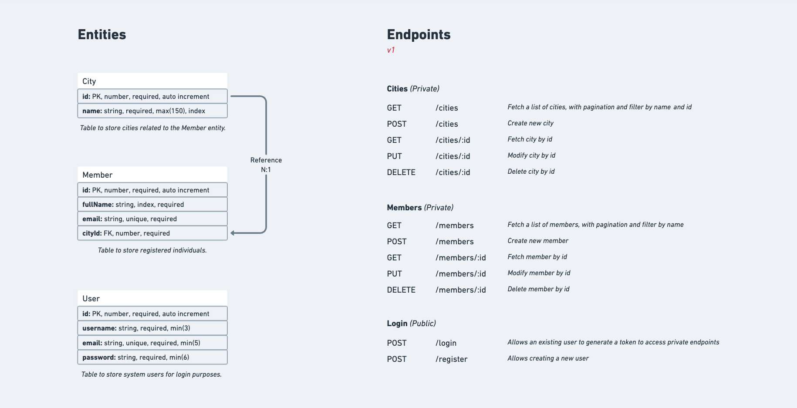

# RESTful API Node.js, TypeScript

This application is designed to manage users, members, and cities.


Deploy: https://api-rest-node-typescript-ctxy.onrender.com/

Entities and endpoints: 



## Main Technologies:


## How to Run / Requirements

You'll need Node.js installed at version 21.x.

After cloning the repository, navigate to the project’s root directory in your terminal to run the commands listed below:

```
$ yarn

```
This command installs the dependencies and libraries specified in the package.json file, creating a folder called "node_modules".


To run the API, use the following command:

```
$ yarn start

```


## Running Tests

After starting the API as described above, open a new terminal, navigate to the project’s root directory, and execute the following command:

```
$ yarn test

```


## Status: Work in Progress

Additional improvements and features will be implemented, such as:

- Application documentation with Swagger.


## Contact

I am available to answer any questions and provide the necessary support. Feel free to reach out via email at thiagoterradev@gmail.com.
